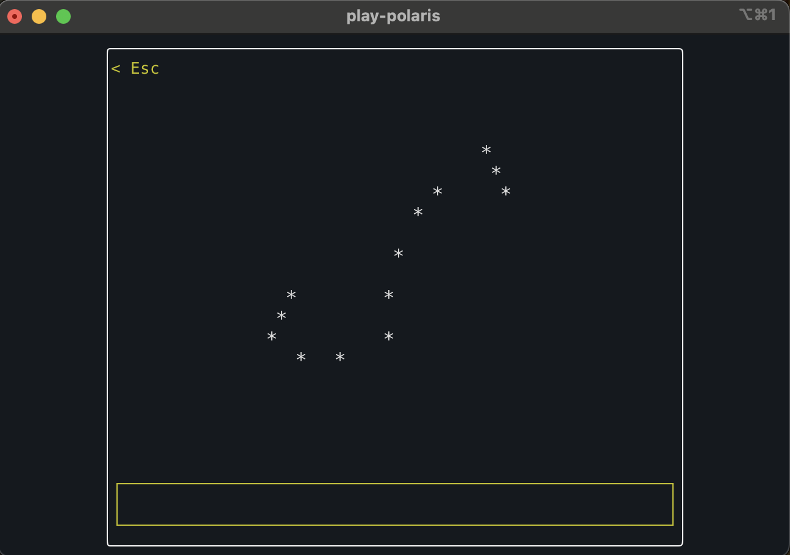
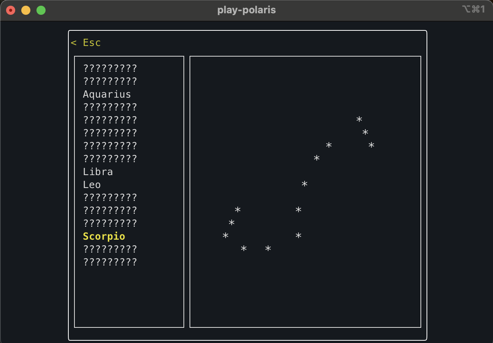
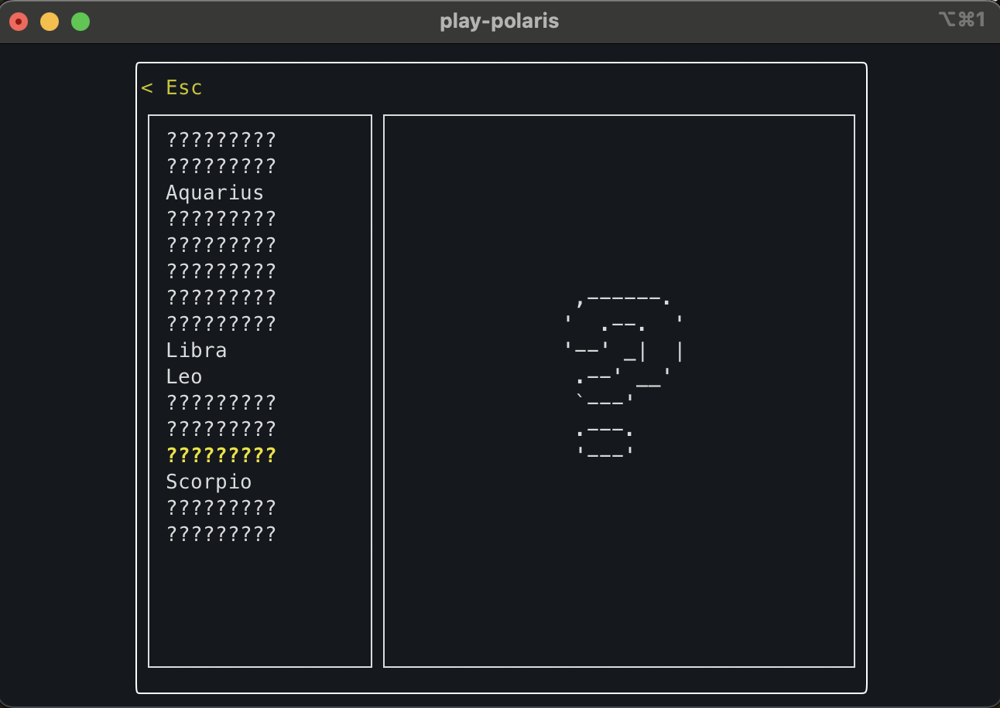

# Play-Polaris
*A terminal-based interactive game for exploring and learning about constellations.*


---

## Overview
Play-Polaris is a Rust-based terminal application that lets you explore the night sky and interactively learn about constellations. The game is both fun and educational, providing a unique TUI experience for astronomy enthusiasts.


---

## Features
- **Interactive terminal-based gameplay** – Learn constellations in a fun, text-based interface.  
- **Two main modes:**  
  - **Explore** – Guess the name of a randomly displayed constellation to unlock it.  
  - **Planetarium** – View all constellations you have explored; unexplored constellations appear as `????`.  
- **Cross-platform** – Runs on Linux, macOS, and Windows.  
- **Lightweight & easy to install** – Install directly via Cargo with minimal dependencies.

---

## Installation

### Prerequisites
- Rust (1.81 or later recommended)
- Cargo (comes with Rust)

### Install via Cargo
```bash
cargo install play-polaris
```

### Run from Source
```bash
git clone https://github.com/pchryss/Polaris
cd play-polaris
cargo run
```

---

## Usage
- Navigate the menu using the on-screen instructions.

**Explore Mode:**  
- A random constellation is displayed.  
- Type its name to "explore" it and add it to your collection.  
- Submit guesses using `ENTER`

**Planetarium Mode:**  
- Browse all constellations you have explored so far.  
- Unexplored constellations appear as `????`.  
- Provides a visual reference of your progress.
- Navigate through planetarium using `UP`/`DOWN` keys

---

## Screenshots

### Explore


### Planetarium



---

## Contributing
Contributions are welcome! Whether it’s a bug fix, feature request, or improvement, feel free to open an issue or submit a pull request.  
Please follow Rust’s standard coding conventions and include clear descriptions for any changes.

---

## License
This project is licensed under **MIT**.  
See the [LICENSE](LICENSE) file for details.